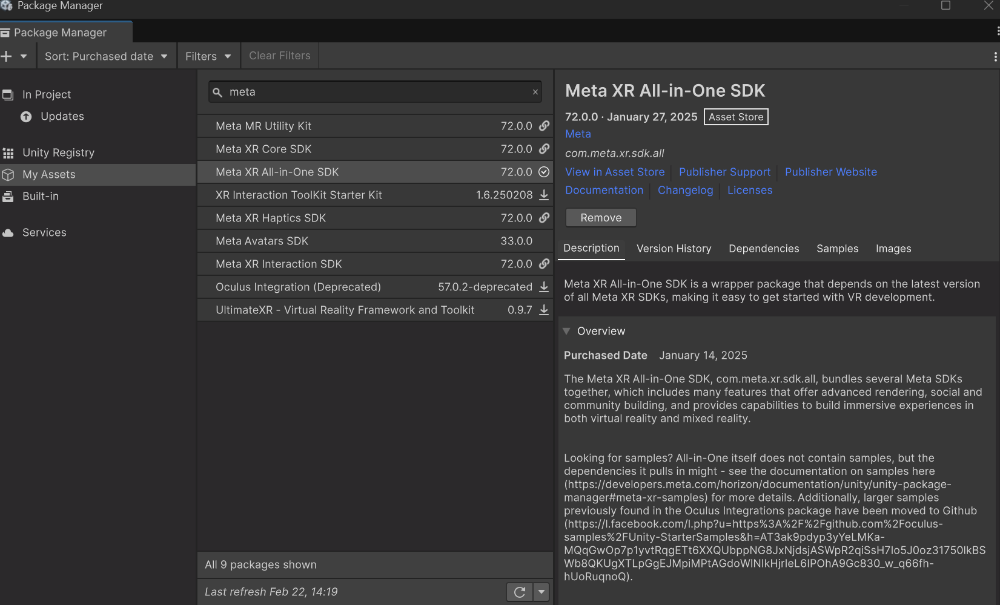
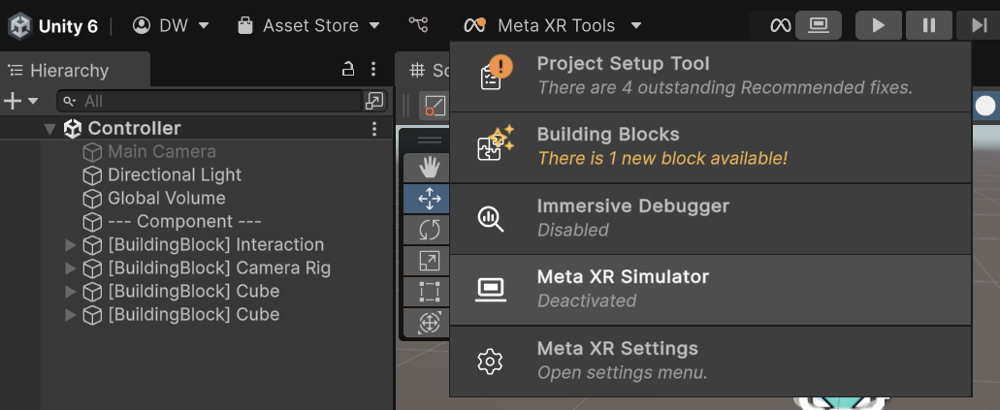
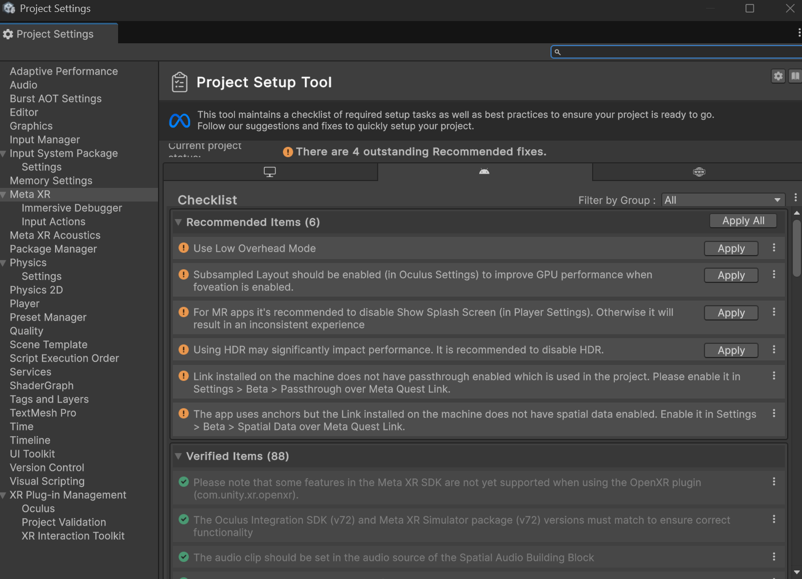
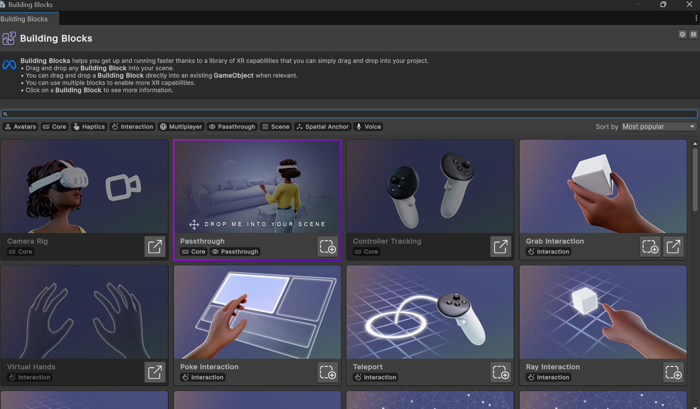
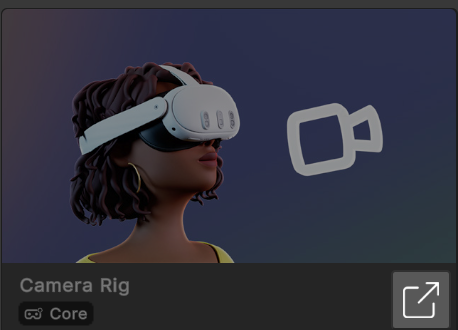
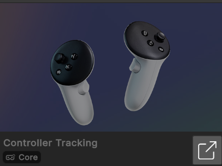
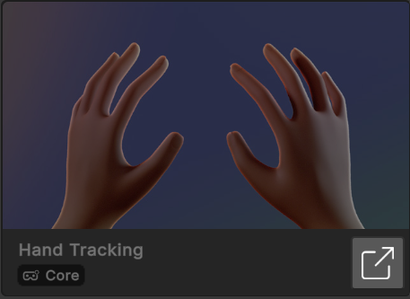
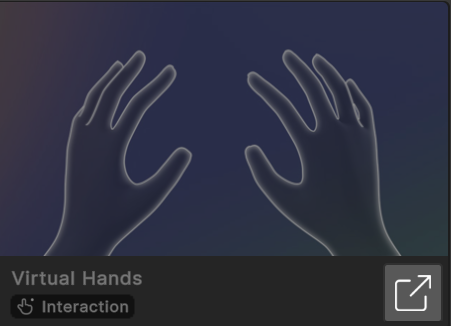
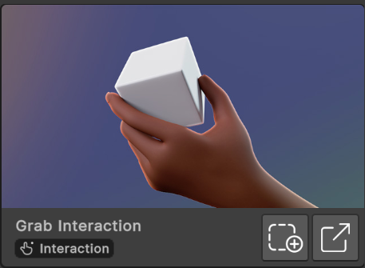

# Tutorial Setting Controller VR menggunakan Meta SDK

## Prerequisites

Sebelum memulai, pastikan Anda memiliki perangkat lunak berikut terinstal:

- [Unity Hub](https://unity.com/download)
- [Visual Studio](https://visualstudio.microsoft.com/) 
- [Asset Store Meta XR All-In-One SDK](https://assetstore.unity.com/search#q=meta%20xr%20all-in-one%20sdk)

## Langkah 1: Membuat Proyek Baru ( menggunakan Unity version 6000.0.38f1)

1. Buka Unity Hub.
2. Klik pada "New Project".
3. Pilih template "Universal 3D" dan beri nama proyek Anda, misalnya `GameVR`.
4. Klik "Create".

## Langkah 2: Install Meta SDK

1. menu `Window` > `Package Manager`.
2. Pilih `Meta XR All-In-One SDK` > `Install`.
3. Klik `Install`.

## Langkah 3: Meta XR Tools

1. Pastikan Anda memiliki Meta XR Tools di Unity dan tidak berindikator merah

2. Jika ada indikator merah, klik `Fix` atau `Apply All`

## Langkah 4: Tambahkan beberapa Building blocks

1. Klik `Meta` > `Building Blocks`.

2. Klik beberapa building blocks yang akan tambahkan ke scene.
-   camera rig

-   controller tracking

-   hand tracking

-   Virtual Hands

-   Grab Interaction

